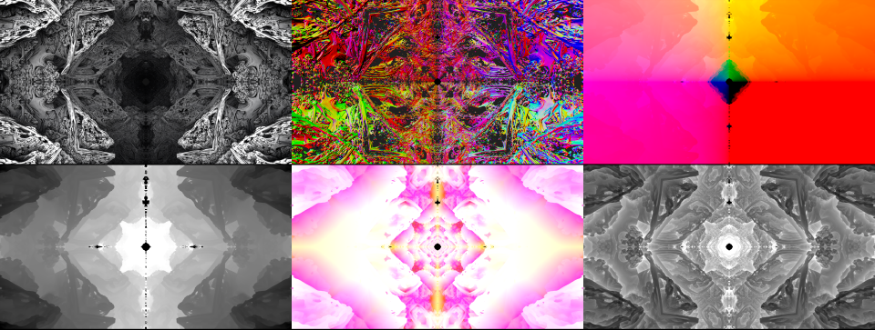

# Romanesco
Romanesco is a GPU based Fractal Renderer developed using the NVIDIA Optix framework, it is still in a work in progress state but has been proven in production already!



### Features:
* Progressive rendering of SDF *(Signed Distance Field)* surfaces using path tracing.
* Dump animated frames to **.exr** files, with useful data channels including surface normal, depth and orbit traps.
* SDF scenes are defined with simple hit kernels, these can be edited and compiled at runtime if Romanesco is built with a CUDA version that supports [NVRTC](http://docs.nvidia.com/cuda/nvrtc/index.html). These scene hit functions can define any possible distance field, by combining primitives using distance operations like those found [here](http://iquilezles.org/www/articles/distfunctions/distfunctions.htm).
* Render scenes in 360 for fractal environment maps!
* Cross-platform (tested on Windows/Linux, builds on Mac).


## Build

### Dependencies
* Qt 5
* [CUDA 7.0](https://developer.nvidia.com/cuda-70-downloads-archive)
* [Optix 3.8.0](https://developer.nvidia.com/designworks/optix/downloads/legacy) *(other versions are untested, may require different CUDA versions)*
* *[Optional]* OpenEXR
* *[Optional]* Boost

***Note: The supported versions of CUDA/Optix will only work with up to VS2013 on Windows, if you are running a more up to date version of VS then install the [build tools](https://www.microsoft.com/en-gb/download/details.aspx?id=40760) and force the toolset as described below***

### Get the code

```
git clone --recursive https://github.com/TomMinor/Romanesco
```

*Note: Make sure to add --recursive so all the submodules in dependencies/ are synced too*

### Configuring CMake

As specified in the [Qt docs](http://doc.qt.io/qt-5/cmake-manual.html), you need to set CMAKE_PREFIX_PATH to Qt5's location.

If Optix, CUDA, OpenEXR or Boost cannot be found (if they are installed in a non-standard location), their locations can be appended to CMAKE_PREFIX_PATH.

***Note: On Windows it is currently necessary to force a 64-bit build with CMAKE_GENERATOR_PLATFORM***
#### Windows
```batch
mkdir build
cd build
cmake .. -DCMAKE_GENERATOR_PLATFORM=x64 -DCMAKE_PREFIX_PATH="D:\Qt\5.8\msvc2013_64;D:\ProgramData\NVIDIA Corporation\OptiX SDK 3.8.0"
```

*Use the toolset argument *(-T)* to force the 2013 compilers in a newer version of Visual Studio (such as [community](https://www.visualstudio.com/vs/community/))*
```batch
cmake .. -DCMAKE_GENERATOR_PLATFORM=x64 -T v120 -DCMAKE_PREFIX_PATH="D:\Qt\5.8\msvc2013_64;D:\ProgramData\NVIDIA Corporation\OptiX SDK 3.8.0"
```


#### Linux
```bash
mkdir build
cd build
cmake .. -DCMAKE_PREFIX_PATH="/opt/Qt/5.8/gcc_64;/opt/NVIDIA-OptiX-SDK-3.8.0-linux64"
```
